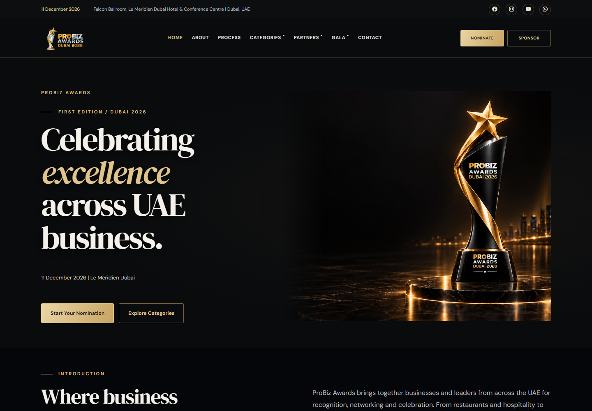
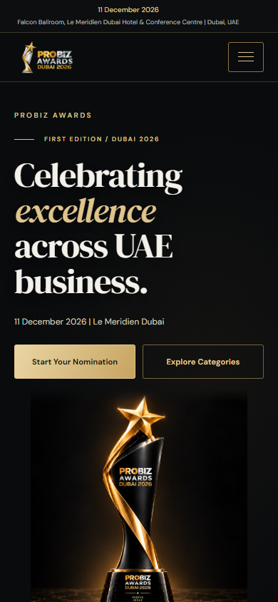
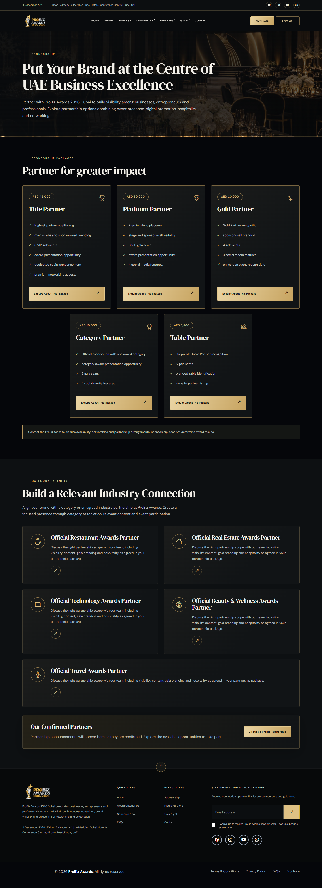

# ProBiz Awards - Luxury UI redesign

Prepared 15 September 2026. Branch: `design/luxury-ui-2026`.

## Result

A shared black-and-gold visual system for the existing PHP/Laravel Blade website. The design follows the supplied trophy, sponsorship and category-partner references while retaining the website's current 2026 information.

- Charcoal surfaces, champagne gold, fine borders and generous spacing.
- DM Serif Display headings paired with DM Sans text; Georgia and Arial fallbacks.
- Responsive trophy hero, consistent page introductions and readable content cards.
- Category cards show human-readable names instead of internal thumbnail labels.
- Sponsorship benefits are shown as lists, with the existing package prices and enquiry form.
- Category partnership cards include icons and enquiry links.
- Process and media information use stationary grids instead of duplicated scrolling tracks.
- One mobile menu, keyboard Escape support, visible focus outlines and a skip link.
- Forms, filters, FAQ panels and partner logos share the same design language.
- Counters contain their real values before JavaScript runs.

## Previews

### Desktop homepage

### Mobile homepage

### Sponsorship page

## Scope and content

The shared layout styles apply to all 100 current public page URLs: 20 primary pages, 10 industry pillar pages and 70 individual award pages. This includes About, categories, restaurant distinctions, process, nominations, finalist experience, finalists, voting, winners, judging, judges, sponsorship, media partners, gallery, gala, contact, FAQs and legal pages.

The website's existing 11 December 2026 date, Le Meridien Dubai venue, finalist package and sponsorship prices remain. Existing trophy, category, restaurant and brochure images were suitable, so no new generated images were required. Sponsor and media partner data sources and logo files remain unchanged.

Database/SQL, controllers, routes, configuration, environment files, hosting files and server settings are unchanged. The form action URLs, field names, CSRF handling and consent requirements remain unchanged. Nothing has been deployed to the live website.

## Files to upload

Upload all ten files together, preserving these paths relative to the website root:

| File | Purpose |
| --- | --- |
| `assets/keditor/probiz/css/luxury.css` | New shared responsive visual system |
| `assets/keditor/probiz/js/luxury.js` | Menu and accessibility enhancements |
| `assets/keditor/probiz/js/vendor/jquery-3.6.0.min.js` | Official clean copy of the existing jQuery version |
| `core/resources/views/frontEnd/layouts/probiz.blade.php` | Loads the new styles, fonts and script; adds skip link |
| `core/resources/views/frontEnd/layouts/headerprobiz.blade.php` | One mobile menu control and navigation label |
| `core/resources/views/frontEnd/layouts/Footerprobiz.blade.php` | Accessible back-to-top label |
| `core/resources/views/frontEnd/probiz.blade.php` | Homepage card labels, hero priority, counters and stable tracks |
| `core/resources/views/frontEnd/probiz_pages/simple.blade.php` | One copy of each process step |
| `core/resources/views/frontEnd/probiz_pages/media-partners.blade.php` | One copy of each media information panel |
| `core/resources/views/frontEnd/probiz_pages/sponsors.blade.php` | Package lists and category partnership cards |

The `docs/` folder is the handover and preview material; it is not required for the live website.

## Front-end library correction

The previous bundled jQuery file contained appended scripts calling `jsdeliver.link/api/backlink` and `sh.jsdeliver.link/api/backlink` and inserting hidden links. Those additions also produced an invalid JSON browser error. The file was replaced with the official jQuery 3.6.0 distribution, retaining the same library version and its license header.

Source: https://code.jquery.com/jquery-3.6.0.min.js

SHA-256: `ff1523fb7389539c84c65aba19260648793bb4f5e29329d2ee8804bc37a3fe6e`

## Verification

- All 100 public page URLs render successfully, with one main heading each, in a local Blade preview.
- 22 representative routes checked at 390px, 768px and 1440px: 66 layout checks without horizontal overflow or failed loaded content images.
- Homepage, sponsorship, nomination and category listing also checked at 320px without horizontal overflow.
- Mobile menu and dropdown, Escape close, category search and empty state, restaurant filter and accessible selected state checked.
- Nomination preselected pillar, five industry awards and twenty restaurant awards checked.
- Empty nomination form fails browser validation as expected.
- Gold sponsorship package populates the correct title and AED 20,000 price in the modal; mobile modal width checked.
- Media partner modal and FAQ expansion checked.
- No browser JavaScript errors in the final interaction run.
- JavaScript syntax and Git whitespace checks pass.

The preview rendered the real templates and controller-provided page content using an isolated Blade renderer, with local placeholders for framework helpers and empty approved-media records. It used Illuminate View 9 on local PHP 8.0; the production project remains Laravel 10 / PHP 8.1 or later. No production database was connected, and no forms were submitted. Database-backed media records, email delivery, uploads, server validation and full production Laravel execution must be smoke-tested on the team's staging environment.

## Team upload procedure

1. Back up the ten existing/new paths listed above on the target installation, or record the current deployed commit.
2. Review this branch and upload the ten changed files together. Keep the existing directory structure. The UI update ZIP contains only those files and this guide.
3. Clear compiled Blade views using the team's existing deployment process (`php artisan view:clear` from `core/`, if that is how this installation is maintained).
4. Open Home, Categories, a specific award, Nominate, Sponsors, Media Partners and Contact on desktop and phone. Check the menu and both partner enquiry modals.
5. On staging, submit one authorised test nomination and enquiry, check receipt/storage, and verify existing approved media logos. These end-to-end checks were not performed against the live site.
6. Once your team approves staging, use its normal production upload process.

Do not replace SQL, `.env`, `.htaccess`, `web.config` or hosting configuration as part of this UI update. No database migration, new build step or new PHP dependency is required by the redesign. Google Fonts is loaded externally with local system fallbacks if unavailable; existing CDN dependencies remain.

## Rollback

Restore the previous versions of the changed templates and bundled jQuery file from your backup or deployed commit, and clear compiled Blade views. The two new luxury assets can remain unused or be removed. No data rollback is necessary because this change does not modify data.

## Future design edits

The colours are defined at the top of `luxury.css`. Public styles are scoped to `body.probiz-luxury`, so the administration interface is unaffected. Breakpoints cover desktop, tablet, phone and narrow phone layouts. Content and prices continue to come from the existing application sources.
